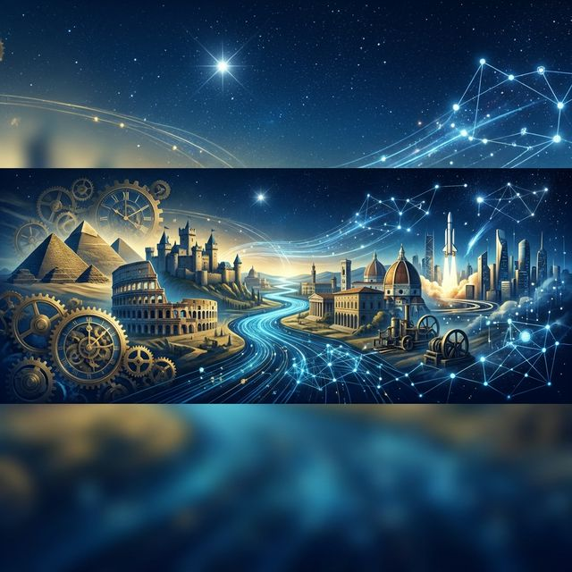
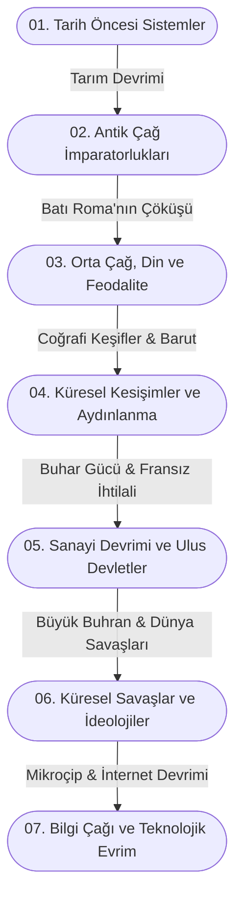

# 🌍 Macro-History-Archive: Küresel Tarih ve Sistem Analizleri

> "Tarih, sadece geçmişin bir kaydı değil; insanlığın sosyolojik, ekonomik ve teknolojik evriminin büyük bir veri setidir."

Bu depo, insanlık tarihinin başlangıcından modern çağa kadar uzanan süreçte medeniyetlerin gelişimini, kırılma noktalarını ve küresel dinamikleri inceleyen kapsamlı ve analitik bir araştırma arşividir. Amacım, tarihi olayları izole edilmiş vakalar olarak değil; ekonomi, teknoloji, coğrafya ve sosyoloji bağlamında birbirine entegre **"sistemler"** olarak analiz etmektir.

---

## 🗂️ Depo Mimarisi ve Kronolojik Sınıflandırma

Aşağıdaki şema, arşivin üzerine kurulu olduğu ana paradigma kırılmalarını göstermektedir:

Klasör yapısı, insanlık tarihinin büyük paradigma değişimlerine ve sistemik kırılma noktalarına göre modüler olarak organize edilmiştir:

### 📂 `01_Tarih_Oncesi_ve_Ilk_Sistemler/`
* Bilişsel Devrim ve Homo Sapiens'in yayılışı.
* Tarım Devrimi: Avcı-toplayıcılıktan yerleşik hayata geçişin mülkiyet ve sınıf kavramlarına etkisi.
* İlk şehir devletlerinin (Sümerler) ve yazının icadının bürokratik sistemleri nasıl kurduğu.

### 📂 `02_Antik_Cag_ve_İmparatorluklar_Mimarisi/`
* Mısır, Mezopotamya ve Çin medeniyetlerinin altyapı projeleri ve merkezi otoriteleri.
* Antik Yunan: Demokrasinin doğuşu, felsefe ve polis (şehir devleti) kültürü.
* Roma İmparatorluğu: Hukuk sistemleri, lojistik ağlar, lejyoner askeri yapısı ve çöküşün çok boyutlu analizi (ekonomik enflasyon, barbar akınları, yönetimsel krizler).

### 📂 `03_Orta_Cag_Din_ve_Feodalite/`
* Kavimler Göçü'nün Avrupa'nın demografik haritasını yeniden çizmesi.
* Feodal sistemin ekonomik tabanı ve toprak mülkiyeti (Serflik ve Senyörlük).
* İslam'ın Altın Çağı: Bilimsel üretim, ticaret yolları ve Antik Yunan metinlerinin korunup geliştirilmesi.
* Haçlı Seferleri: Dini motivasyonların arkasındaki ekonomik ve jeopolitik itici güçler.

### 📂 `04_Kuresel_Kesisimler_ve_Aydinlanma/`
* Coğrafi Keşifler: İpek ve Baharat yollarının baypas edilmesi, sömürgeciliğin doğuşu.
* Rönesans ve Reform: Bireyciliğin yükselişi, kilise otoritesinin sarsılması ve matbaanın bilgi devrimi.
* Merkantilizmden Erken Kapitalizme geçiş süreçleri.

### 📂 `05_Sanayi_Devrimi_ve_Modern_Ulus_Devletler/`
* Buhar gücünün icadı, makineleşme ve üretim sistemlerindeki radikal değişim.
* Fransız İhtilali: Ulus-devlet modelinin inşası ve milliyetçilik akımları.
* 19. Yüzyıl Emperyalizmi: Hammadde arayışı, Afrika'nın paylaşımı ve küresel güç dengeleri.

### 📂 `06_20inci_Yuzyil_Kuresel_Savaslar_ve_Ideolojiler/`
* I. Dünya Savaşı: Eski imparatorlukların yıkılışı ve Orta Doğu'nun yeniden şekillenmesi.
* 1929 Büyük Buhranı: Küresel ekonomik sistemin çöküşü ve radikal ideolojilerin yükselişi (Faşizm, Nazizm).
* II. Dünya Savaşı: Topyekün savaş konsepti, teknolojik sıçramalar ve atom bombasının jeopolitik sonuçları.
* Soğuk Savaş: İki kutuplu dünya, nükleer caydırıcılık (MAD), uzay yarışı ve vekalet savaşları.

### 📂 `07_Bilgi_Cagi_ve_Teknolojik_Evrim/`
* İnternetin icadı ve küresel iletişimin demokratikleşmesi.
* Dijitalleşme, küreselleşme ve çok uluslu şirketlerin yükselişi.
* Yapay Zeka Devrimi'nin tarihsel bağlamdaki yeri: Yeni bir üretim biçimi mi?

### 📂 `00_Tematik_ve_Sosyolojik_Analizler/`
* `Ekonomik_Krizler_Tarihi`: Lale Çılgınlığı'ndan 2008 Krizine.
* `Savas_Teknolojileri_ve_Strateji`: Falanks düzeninden insansız otonom sistemlere askeri devrimler.
* `Kuresel_Salgınlar_ve_Demografi`: Veba, İspanyol Gribi ve Covid-19'un toplumsal etkileri.

---

## 🔬 İnceleme Metodolojisi ve Felsefem

Bu depodaki tüm içerikler aşağıdaki analitik prensipler çerçevesinde oluşturulmaktadır:

1. **Çok Boyutlu Analiz (Sistem Düşüncesi):** Hiçbir olay tek bir nedenle açıklanamaz. Her bir kırılma noktası; teknolojik, ekonomik ve sosyolojik parametrelerin bir fonksiyonu olarak incelenir.
2. **Korelasyon ve Nedensellik Ayrımı:** Olaylar arasındaki bağlar kurulurken, dönemin ruhu (zeitgeist) göz önünde bulundurulur ve anakronizme (geçmişteki bir olayı bugünün şartlarıyla değerlendirme hatası) düşülmez.
3. **Objektif Veri Kullanımı:** Kişisel veya ulusal anlatılardan ziyade, belgelere, ekonomik verilere ve çoklu kaynak okumalarına dayanır.

---

## 🛠️ Kullanılan Araçlar ve Çalışma Düzeni

* **Markdown (MD):** Tüm notlar standart, temiz ve taşınabilir formatta tutulmaktadır.
* **Görselleştirme:** Timeline (zaman çizelgesi) ve olaylar arası bağlantı haritaları için ilerleyen süreçte dış bağlantılar (Mermaid.js, Obsidian Graph vb.) entegre edilecektir.
* **Kaynak Yönetimi:** Her belgenin sonunda kullanılan referanslar, okunan makaleler ve kitaplar açıkça belirtilir.

---

## 🚀 Gelecek Planları (Roadmap)

- [ ] Tüm Markdown dosyaları için standart bir "Olay İnceleme Şablonu" oluşturulması (Tarih, Aktörler, Sebepler, Sonuçlar, Etkilenen Sistemler).
- [ ] Dönemler arası kavramsal bağlantıları gösteren konsept haritalarının (mind map) oluşturulması.
- [ ] Önemli tarihi kararların *Oyun Teorisi (Game Theory)* bağlamında analitik olarak incelenmesi.
- [ ] Tarihsel metinler üzerinde gelecekte yapılabilecek potansiyel veri madenciliği (data mining) projeleri için uygun yapısal formatın korunması.

---
> *"Geleceği inşa etmek ve sistemleri anlamak için, geçmişin veri setini ve mimarisini çözmek zorundayız."*