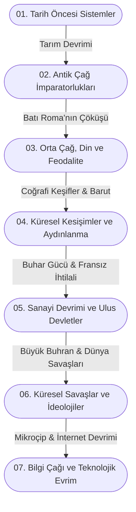

# 🌍 Macro-History-Archive: Küresel Tarih ve Sistem Analizleri

> *"Tarih, sadece geçmişin bir kaydı değil; insanlığın sosyolojik, ekonomik ve teknolojik evriminin büyük bir veri setidir."*

## 🌟 Neden Bu Proje? (Manifesto)

Günümüzde tarih öğretimi genellikle kralların isimleri, savaş tarihleri ve izole edilmiş bölgesel olaylar üzerinden yapılmaktadır. Ancak insanlık tarihi, birbirinden bağımsız tesadüflerin bir araya gelmesiyle değil; tıpkı bir organizma veya bir bilgisayar ağı gibi, birbirine derinden bağlı **kompleks sistemlerin** (ekonomi, coğrafya, teknoloji, psikoloji) etkileşimiyle şekillenmiştir.

**Macro-History-Archive (Makro-Tarih Arşivi)**, bu vizyonla doğdu. Amacım, insanlık tarihinin başlangıcından (Bilişsel Devrim) modern bilgi çağına kadar uzanan süreçte medeniyetlerin yükselişini, kırılma noktalarını ve çöküşlerini analitik bir çerçevede incelemektir. Tarihi olayları izole vakalar olarak değil, küresel dinamiklerin birer sonucu olarak *'Sistem Teorisi'* ve *'Oyun Teorisi'* bağlamında deşifre ediyoruz.

---

## 🎯 Kimin İçin?

Bu açık kaynaklı arşiv projesi şunlar için tasarlanmıştır:
- **Tarih ve Sosyoloji Meraklıları:** Olayların arka planındaki "neden" sorusunu, ezberden uzak bir analitikte arayanlar.
- **Veri Bilimciler ve Sistem Mühendisleri:** Geçmişin verilerini (ekonomik krizler, salgınlar, savaşlar) geleceğin sistemlerini modellemek için kullanmak isteyenler.
- **Stratejistler ve Oyun Teorisyenleri:** İnsan karar alma mekanizmalarının ve devlet reflekslerinin, yüzyıllar boyunca hangi şartlarda nasıl davrandığını (pattern/kalıp arayışı) inceleyenler.

---

## 🗂️ Depo Mimarisi ve Kronolojik Sınıflandırma

Aşağıdaki şema, arşivin üzerine kurulu olduğu ana paradigma kırılmalarını göstermektedir. Detaylı klasörleri incelemeden önce medeniyetlerin büyük geçişlerini bu harita üzerinden okuyabilirsiniz:

Klasör yapısı, insanlık tarihinin büyük paradigma değişimlerine ve sistemik kırılma noktalarına göre modüler olarak organize edilmiştir:

### 📂 `01_Tarih_Oncesi_ve_Ilk_Sistemler/`
* Bilişsel Devrim ve Homo Sapiens'in küresel yayılışı.
* Tarım Devrimi: Avcı-toplayıcılıktan yerleşik hayata geçişin mülkiyet ve sınıf kavramlarına etkisi.
* İlk şehir devletlerinin (Sümerler) kuruluşu ve yazının (bilgi depolamanın) bürokratik sistemleri nasıl inşa ettiği.

### 📂 `02_Antik_Cag_ve_İmparatorluklar_Mimarisi/`
* Mısır, Mezopotamya ve Çin medeniyetlerinin merkezi otoriteleri ve mega altyapı projeleri.
* Antik Yunan: Felsefenin doğuşu, rasyonel düşünce ve doğrudan demokrasi denemeleri.
* Roma İmparatorluğu: Lojistik ağlar, lejyon mimarisi, hukuk sistemleri ve çok boyutlu çöküş teorileri (enflasyon, iklim değişimi, barbar akınları).

### 📂 `03_Orta_Cag_Din_ve_Feodalite/`
* Kavimler Göçü'nün Avrupa'nın demografik haritasını yeniden çizmesi.
* Feodal sistemin ekonomik tabanı: Serflik, toprak ağalığı ve merkezi otoritenin ademi merkeziyetçiliğe evrimi.
* İslam'ın Altın Çağı: Antik Yunan metinlerinin korunması, bilimsel üretim ve kıtalararası ticaret ağları.
* Haçlı Seferleri ve Moğol İstilası (Pax Mongolica): Dini ve askeri motivasyonların arkasındaki ekonomik itici güçler.

### 📂 `04_Kuresel_Kesisimler_ve_Aydinlanma/`
* Coğrafi Keşifler: İpek ve Baharat yollarının baypas edilmesi, Atlantik ekonomisinin doğuşu ve sömürgecilik.
* Rönesans ve Reform: Bireyciliğin yükselişi, matbaanın icadıyla kilisenin bilgi üzerindeki tekelinin yıkılması.
* Merkantilizmden erken kapitalizme ve şirketlerin (Doğu Hindistan Kumpanyaları) doğuşuna geçiş süreçleri.

### 📂 `05_Sanayi_Devrimi_ve_Modern_Ulus_Devletler/`
* Buhar gücünün icadı: İnsan/hayvan kas gücünden makine gücüne geçiş, üretim ilişkilerindeki radikal sarsıntı.
* Fransız İhtilali: Ulus-devlet modelinin inşası, mutlak monarşilerin yıkılışı ve milliyetçilik akımları.
* 19. Yüzyıl Emperyalizmi: Hammadde arayışı, sanayi ekonomisinin küresel sömürü ağları ve "Büyük Oyun" (Great Game).

### 📂 `06_20inci_Yuzyil_Kuresel_Savaslar_ve_Ideolojiler/`
* I. Dünya Savaşı: Çok uluslu eski imparatorlukların yıkılışı ve yapay Ortadoğu haritaları.
* 1929 Büyük Buhranı: Küresel kapitalist sistemin ilk büyük krizi ve radikal ideolojilerin (Faşizm, Nazizm) yükselişi.
* II. Dünya Savaşı: Topyekün savaş konsepti, endüstriyel ölüm makineleri ve atom bombasının jeopolitik sonuçları.
* Soğuk Savaş: Nükleer caydırıcılık (MAD), uzay yarışı, vekalet savaşları ve iki kutuplu dünyanın ekonomik mücadelesi.

### 📂 `07_Bilgi_Cagi_ve_Teknolojik_Evrim/`
* İnternetin icadı: Küresel iletişimin demokratikleşmesi, dijitalleşme ve bilginin anlık dolaşımı.
* Küreselleşme, tedarik zincirlerinin entegrasyonu ve çok uluslu teknoloji şirketlerinin devletlerüstü güçleri.
* Yapay Zeka Devrimi (Bugün ve Gelecek): Yeni bir üretim biçimi, otonom sistemler ve transhümanizm tartışmaları.

### 📂 `00_Tematik_ve_Sosyolojik_Analizler/`
* *Kronolojik sıralamaya girmeyen özel başlıklar:*
* `Ekonomik_Krizler_Tarihi`: Lale Çılgınlığı'ndan 2008 Krizine finansal panikler.
* `Savas_Teknolojileri_ve_Strateji`: Falanks düzeninden insansız hava araçlarına askeri devrimler.
* `Kuresel_Salgınlar_ve_Demografi`: Kara Veba'nın feodaliteyi nasıl bitirdiği, İspanyol Gribi ve Covid-19'un toplumsal etkileri.

---

## 🔬 İnceleme Metodolojisi ve Felsefem

Bu depodaki tüm içerikler (kendi araştırmalarınız ya da toplulukk katkıları) aşağıdaki analitik prensipler çerçevesinde oluşturulmaktadır:

1. **Sistem Düşüncesi (Çok Boyutlu Analiz):** Hiçbir olay tek bir sebeple açıklanmaz. (Örnek: Fransız İhtilali sadece Aydınlanma felsefesiyle değil, Laki ve Ladan volkanlarının patlamasının getirdiği kötü hasat ve ekmek kriziyle de doğrudan bağlantılıdır.)
2. **Korelasyon ve Nedensellik Ayrımı:** Olaylar arasındaki bağlar kurulurken, dönemin ruhu (*zeitgeist*) göz önünde bulundurulur. Anakronizme (geçmişteki bir olayı bugünün ahlaki şartlarıyla değerlendirme hatasına) kesinlikle düşülmez. Rasyonel aktörlerin kararları dönemin şartları altında değerlendirilir.
3. **Objektif Veri ve Kaynakça Taraması:** Kişisel, ulusal veya ideolojik anlatılardan (propaganda) şiddetle kaçınılır. Araştırmalar istatistiklere, belgelere, ekonomik verilere ve akademik çoklu okumalar üzerine inşa edilir.

---

## 🤝 Katkıda Bulunma (Contributing)

Bu depo yaşayan bir arşive dönüşmek için tasarlanmıştır. Tarih, felsefe, sosyoloji veya teknoloji ile ilgileniyorsanız bilginizi bizimle paylaşın!

Yeni bir tarihi olay eklemek veya var olan bir analizi düzeltmek için özel şablonlarımız mevcuttur. Lütfen süreci öğrenmek için **[CONTRIBUTING.md](CONTRIBUTING.md)** dosyamızı dikkatle okuyun. Açacağınız Issue'lar ve Pull Request'ler proje yöneticileri tarafından bilimsel tutarlılık açısından incelenerek ana projeye dahil edilecektir. Topluluk standartlarımıza uymak için **[CODE_OF_CONDUCT.md](CODE_OF_CONDUCT.md)** kurallarını dikkate alınız.

---

## 🛠️ Kullanılan Araçlar ve Çalışma Düzeni

* **Markdown (MD):** Tüm notlar standart, temiz okunabilir ve taşınabilir formatta tutulmaktadır. (Bkz: `_templates/Olay_Inceleme_Sablonu.md`)
* **Görselleştirme:** Timeline ve olaylar arası bağlantı haritaları için **Mermaid.js** entegrasyonu mevcuttur.
* **Kaynak Yönetimi:** Her belgenin sonunda kullanılan referanslar, okunan makaleler ve kitaplar açıkça belirtilmek zorundadır.

---

## 🚀 Gelecek Planları (Roadmap)

- [x] Temel depo mimarisinin kurulması ve klasörlerin oluşturulması.
- [x] Olay İnceleme şablonunun (Markdown) standartlaştırılması.
- [x] Topluluk katkı kurallarının (`CONTRIBUTING.md`, `CODE_OF_CONDUCT.md`) belirlenmesi.
- [x] Açık Kaynak formatı için Issue ve PR şablonlarının oluşturulması.
- [x] Örnek ilk analizin (Fransız İhtilali) yayımlanması.
- [ ] Dönemler arası kavramsal bağlantıları gösteren konsept haritalarının (mind map) oluşturulması.
- [ ] Önemli tarihi kararların *Oyun Teorisi (Game Theory)* bağlamında analitik ve matematiksel olarak incelendiği özel bir klasör açılması.
- [ ] Olayların istatistiksel veri setlerinin (json/csv formatında) araştırma metinlerine eklenmesi (Veri Madenciliği altyapısı).

---

## 📜 Lisans

Bu proje, açık kaynak topluluğunun faydalanması ve geliştirmesi amacıyla **MIT Lisansı** ile sunulmaktadır. Daha fazla bilgi için `LICENSE` dosyasını inceleyebilirsiniz.

---
> *"Geleceği inşa etmek ve sistemleri anlamak için, geçmişin devasa veri setini ve sosyal mimarisini çözmek zorundayız."*