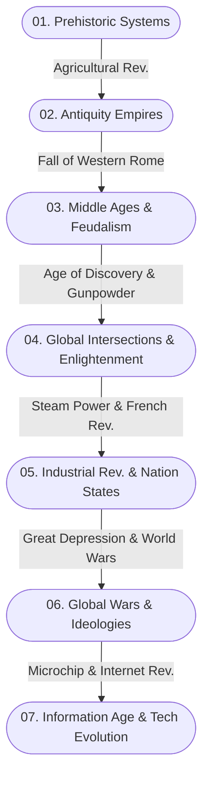

# 🌍 Macro-History-Archive: Global History and Systems Analysis

> *"History is not merely a record of the past; it is an immense dataset of humanity's sociological, economic, and technological evolution."*

[🇹🇷 Türkçe Oku (Read in Turkish)](README.md)

## 🌟 Why This Project? (Manifesto)

Today, history is often taught through the names of kings, dates of battles, and isolated regional events. However, the history of humanity was not shaped by a series of independent coincidences; rather, like an organism or a computer network, it was shaped by the interaction of deeply connected **complex systems** (economy, geography, technology, psychology).

The **Macro-History-Archive** was born with this vision. My goal is to examine the rise, tipping points, and collapse of civilizations in an analytical framework from the dawn of human history (the Cognitive Revolution) to the modern Information Age. We decipher historical events not as isolated cases, but as consequences of global dynamics within the context of *'Systems Theory'* and *'Game Theory'*.

---

## 🎯 Who is it for?

This open-source archive project is designed for:
- **History and Sociology Enthusiasts:** Those looking for the "why" behind events with an analytical approach, away from rote memorization.
- **Data Scientists and Systems Engineers:** Those who want to use the data of the past (economic crises, pandemics, wars) to model the systems of the future.
- **Strategists and Game Theorists:** Those examining how human decision-making mechanisms and state reflexes have behaved (searching for patterns) under varying conditions throughout centuries.

---

## 🗂️ Repository Architecture and Chronological Classification

The diagram below illustrates the major paradigm shifts upon which the archive is built. Before diving into detailed folders, you can trace the grand transitions of civilizations on this map:

The directory structure is modularly organized according to the major paradigm shifts and systemic tipping points of human history:

### 📂 `01_Tarih_Oncesi_ve_Ilk_Sistemler/` (Prehistory and Early Systems)
* The Cognitive Revolution and global spread of Homo Sapiens.
* The Agricultural (Neolithic) Revolution: The impact of transitioning from hunter-gatherers to settled life on concepts of property and class.
* The founding of the first city-states (Sumerians) and how the invention of writing (data storage) built bureaucratic systems.

### 📂 `02_Antik_Cag_ve_İmparatorluklar_Mimarisi/` (Antiquity and Architecture of Empires)
* Centralized authorities and mega-infrastructure projects of Egyptian, Mesopotamian, and Chinese civilizations.
* Ancient Greece: The birth of philosophy, rational thought, and direct democracy experiments.
* Roman Empire: Logistic networks, legion architecture, legal systems, and multi-dimensional collapse theories (inflation, climate change, barbarian invasions).

### 📂 `03_Orta_Cag_Din_ve_Feodalite/` (Middle Ages, Religion, and Feudalism)
* How the Migration Period redrew Europe's demographic map.
* The economic base of the Feudal System: Serfdom, manorialism, and the evolution of central authority to decentralization.
* The Golden Age of Islam: Preservation of Ancient Greek texts, scientific production, and intercontinental trade networks.
* The Crusades and the Mongol Invasions (Pax Mongolica): The economic driving forces behind religious and military motivations.

### 📂 `04_Kuresel_Kesisimler_ve_Aydinlanma/` (Global Intersections and Enlightenment)
* Age of Discovery: Bypassing the Silk and Spice routes, the birth of the Atlantic economy, and colonialism.
* Renaissance and Reformation: The rise of individualism, the breaking of the Church's monopoly on information with the invention of the printing press.
* Transition processes from Mercantilism to early capitalism and the birth of corporations (East India Companies).

### 📂 `05_Sanayi_Devrimi_ve_Modern_Ulus_Devletler/` (Industrial Revolution and Modern Nation-States)
* The invention of Steam Power: Transition from human/animal muscle power to machine power, a radical shake-up in relations of production.
* The French Revolution: Construction of the nation-state model, the fall of absolute monarchies, and nationalist movements.
* 19th-Century Imperialism: The quest for raw materials, global exploitation networks of the industrial economy, and the "Great Game".

### 📂 `06_20inci_Yuzyil_Kuresel_Savaslar_ve_Ideolojiler/` (20th Century: Global Wars and Ideologies)
* World War I: The collapse of multi-ethnic old empires and artificial Middle East borders.
* The 1929 Great Depression: The first major crisis of the global capitalist system and the rise of radical ideologies (Fascism, Nazism).
* World War II: The concept of total war, industrial death machines, and the geopolitical consequences of the atomic bomb.
* The Cold War: Nuclear deterrence (MAD), the space race, proxy wars, and the economic struggle of a bipolar world.

### 📂 `07_Bilgi_Cagi_ve_Teknolojik_Evrim/` (Information Age and Technological Evolution)
* The invention of the Internet: The democratization of global communication, digitalization, and the instant circulation of information.
* Globalization, integration of supply chains, and the supranational powers of multinational tech companies.
* The Artificial Intelligence Revolution (Present and Future): A new mode of production, autonomous systems, and transhumanism debates.

### 📂 `00_Tematik_ve_Sosyolojik_Analizler/` (Thematic and Sociological Analyses)
* *Special topics that do not fit a chronological order:*
* `History of Economic Crises`: Financial panics from Tulip Mania to the 2008 Crisis.
* `War Technologies and Strategy`: Military revolutions from the Phalanx formation to unmanned aerial vehicles.
* `Global Pandemics and Demography`: How the Black Death ended feudalism, the societal impacts of the Spanish Flu and Covid-19.

---

## 🔬 Analysis Methodology and Philosophy

All content in this repository is created within the framework of the following analytical principles:

1. **Systems Thinking (Multi-Dimensional Analysis):** No event is explained by a single cause. (Example: The French Revolution is not only linked to Enlightenment philosophy, but also directly to poor harvests and bread crises brought on by the Laki eruptions).
2. **Distinguishing Correlation and Causation:** When establishing links between events, the spirit of the times (*zeitgeist*) is considered. We strictly avoid anachronism (the error of judging a past event by today's moral standards). The decisions of rational actors are evaluated under the conditions of their time.
3. **Objective Data and Source Scanning:** Personal, national, or ideological narratives (propaganda) are strictly avoided. Research is built upon statistics, documents, economic data, and multiple academic readings.

---

## 🤝 Contributing

This repository is designed to become a living archive. If you are interested in history, philosophy, sociology, or technology, share your knowledge with us!

We have specific templates for adding a new historical event or correcting an existing analysis. Please read our **[CONTRIBUTING.md](CONTRIBUTING.md)** file carefully to learn the process. To comply with our community standards, please consider the **[CODE_OF_CONDUCT.md](CODE_OF_CONDUCT.md)** rules.

---

## 🛠️ Tools Used and Workflow

* **Markdown (MD):** All notes are kept in a standard, clean, readable, and portable format.
* **Visualization:** **[Interactive Causal Loop Diagram](Sistem_Dinamikleri_Haritasi.md)** (Mermaid.js) is available to explore the macro-historical connectivity network.
* **Source Management:** References, articles, and books read must be clearly stated at the end of each document.
* **Data Sets:** We provide Open Source CSV datasets mapping macro-historical events under the `_datasets/` directory. Example: **[Roman Emperors & Inflation Dataset](_datasets/roman_emperors_and_inflation.csv)**

---

## 📜 License

This project is licensed under the **MIT License** for the benefit and development of the open-source community. See the `LICENSE` file for more information.

---
> *"To build the future and understand systems, we must decode the massive dataset and social architecture of the past."*
