# Tarihsel Sistem Dinamikleri Haritası (Causal Loop Diagram)

Aşağıdaki devasa ağ haritası, repomuzdaki olayların rastgele değil, devasa bir **"Geri Besleme Döngüsü" (Feedback Loop)** içerisinde nasıl birbirini tetiklediğini göstermektedir. Olayların yanındaki oklar, birbirleri üzerindeki sistemik baskıları ifade eder.

```mermaid
graph TD
    %% Stil Tanımlamaları
    classDef eco fill:#1A365D,stroke:#fff,stroke-width:2px,color:#fff;
    classDef tech fill:#064E3B,stroke:#fff,stroke-width:2px,color:#fff;
    classDef soc fill:#581C87,stroke:#fff,stroke-width:2px,color:#fff;
    classDef crisis fill:#7F1D1D,stroke:#fff,stroke-width:2px,color:#fff;

    %% Düğümler
    A("Buzul Çağının Bitişi / İklim Isınması"):::eco
    B("Tahılın Bolluğu ve Nüfus Artışı"):::soc
    C("YERLEŞİK HAYAT & TARIM DEVRİMİ"):::tech
    D("Artı Ürün (Surplus) Birikimi"):::eco
    E("Mülkiyet ve Elit Sınıfların Doğuşu"):::soc
    F("Askeri Sınıf ve Surlu Şehirler"):::tech
    G("Merkezi İmparatorluklar (Roma/Han)"):::soc

    H("Sınırların Aşırı Genişlemesi"):::soc
    I("Askeri Lojistik Maliyetinin Artması"):::eco
    J("Vergilerin Yükselmesi & Paranın Değersizleşmesi (Enflasyon)"):::crisis
    K("Kırsal Çöküş ve Cermen (Barbar) Akınları"):::crisis
    L("BATI ROMA'NIN ÇÖKÜŞÜ"):::crisis
    M("Köylülerin Baronlara Sığınması (Serflik)"):::soc
    N("FEODALİTE SİSTEMİ (Güvenliğin Özelleşmesi)"):::soc

    O("Pax Mongolica (İpek Yolu Güvenliği)"):::eco
    P("Ticaretin ve İletişimin Küreselleşmesi"):::tech
    Q("Hastalıkların Küreselleşmesi (KARA VEBA)"):::crisis
    R("Avrupa Nüfusunun %40 Eriyerek Emek Arzının Çökmesi"):::soc
    S("İşgücünün Değerlenmesi & Serfliğin Bitişi"):::eco
    T("Teknolojik Çözüm Arayışı (Mekanikleşme)"):::tech
    U("RÖNESANS VE SERMAYE BİRİKİMİ"):::eco

    V("Matbaanın İcadı"):::tech
    W("Bilginin Yayılması & Kilise Otoritesinin Yıkımı"):::soc
    X("Avrupa Rekabeti ve Coğrafi Keşifler"):::eco
    Y("Sömürgecilik & Küresel Hammadde Akışı"):::eco
    Z("Buhar Gücü ve Fabrika Sistemi"):::tech
    AA("SANAYİ DEVRİMİ VE İŞÇİ SINIFI"):::soc

    %% Bağlantılar ve Geri Beslemeler (Causal Links)
    A --> B
    B --> C
    C --> D
    D --> E
    E --> F
    F --> G
    
    G --> H
    H --> I
    I --> J
    J --> K
    K --> L
    L --> M
    M --> N
    
    N --> O
    O --> P
    P --> Q
    Q --> R
    R --> S
    S --> N -.->|Feodaliteyi Yıktı| S
    S --> T
    T --> U
    
    U --> V
    V --> W
    U --> X
    X --> Y
    Y --> Z
    T --> Z
    Z --> AA
```

> **Nasıl Okunmalı?**
> * Kırmızı Hatlar: Krizleri ve Çöküşleri (Veba, Enflasyon, Çöküş).
> * Yeşil Hatlar: Teknolojik Sıçramaları (Tarım, Matbaa, Buhar Gücü).
> * Mavi Hatlar: Ekonomik ve Sosyolojik Dönüşümleri (Mülkiyet, Serflik, Sermaye) temsil eder.
> Tarihteki her kriz, aslında önceki büyük sistemin "taşıma kapasitesini (carrying capacity)" zorlamasının bir sonucudur. Veba'nın emek piyasasını yıkıp mekanik devrimi (sanayiyi) zorlaması; tıpkı Antik Roma'da çok büyümenin mali çöküşü (enflasyon) getirmesi gibi 'matematiksel' bir sistem çıktısıdır.
